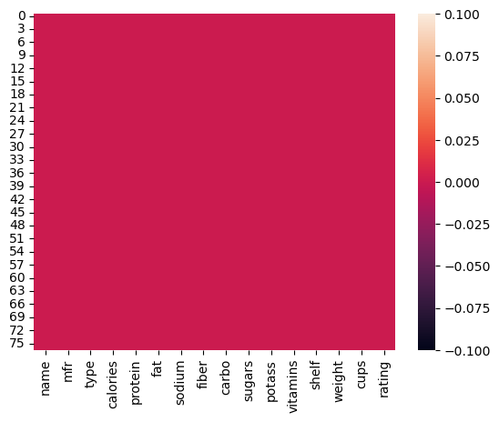
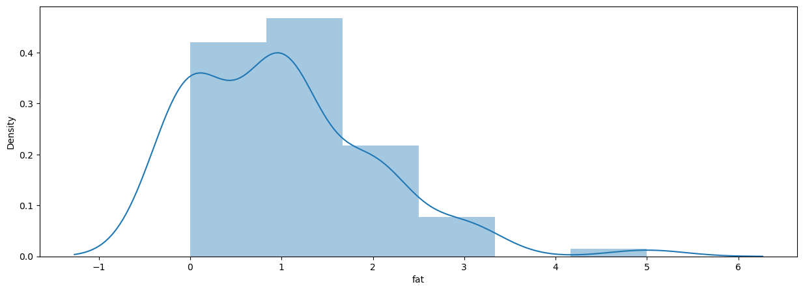

# Laporan Proyek Machine Learning
### Nama : Zulfa salsabila Adzkia
### Nim : 211351153
### Kelas : Pagi B

## Domain Proyek

 estimasi kandungan serat pada cereal merujuk pada wilayah penelitian atau usaha yang berfokus pada mengukur, memprediksi, atau menganalisis kandungan serat dalam produk sereal. 

**Rubrik/Kriteria Tambahan (Opsional)**:
- Jelaskan mengapa dan bagaimana masalah tersebut harus diselesaikan
- Menyertakan hasil riset terkait atau referensi. Referensi yang diberikan harus berasal dari sumber yang kredibel dan author yang jelas.
  
  Format Referensi:https://bestjournal.untad.ac.id/index.php/kovalen/article/view/12788

## Business Understanding

Pemahaman mendalam tentang bagaimana penilaian dan pengukuran kandungan serat dalam sereal memengaruhi aspek yang terkait dengan produk sereal.

Bagian laporan ini mencakup:

### Problem Statements

Menjelaskan pernyataan masalah latar belakang:
- Bagaimana kita dapat mengukur atau memprediksi dengan tepat kandungan serat dalam berbagai jenis sereal. 

### Goals

Menjelaskan tujuan dari pernyataan masalah:
- untuk mengukur kandungan serat pada sereal.

**Rubrik/Kriteria Tambahan (Opsional)**:
- Menambahkan bagian “Solution Statement” yang menguraikan cara untuk meraih goals. Bagian ini dibuat dengan ketentuan sebagai berikut: 

    ### Solution statements
    - Pengembangan Platfrom Pencarian Kandungan serat pada sereal. Solusi pertama adalah mengembangkan platfrom pencarian kandungan serat pada sereal yang mengintegrasikan data dari Kaggle.com untuk memberikan pengguna akses cepat dan mudah ke informasi tentang estimasi kandungan serat pada sereal berdasarkan kriteria tertentu seperti calories,protein,fat,sodium,sugars,potass,vitamins
    - Model yang dihasilkan dari dataset itu menggunakan metode Linear Regression.
## Data Understanding
Dataset yang saya gunakan berasal dari Kaggle yang berisi tentang kandungan serat pada sereal. Dataset ini mengandung   

Contoh: https://www.kaggle.com/datasets/crawford/80-cereals
 

### Variabel-variabel pada 80 Cereals Dataset adalah sebagai berikut:
- calories : Kalori Per Porsi (Integer)
- protein : Gram Protein (Integer)
- fat : Gram Lemak (Integer)
- sodium : Miligram Natrium (Integer)
- sugars : Gram Gula (Integer)
- potass : Miligram Kalium (Integer)
- vitamins : Vitamin dan Mineral -0,25, atau 100,menunjukan persentase khas yang direkomendasikan FDA.(Integer)

**Rubrik/Kriteria Tambahan (Opsional)**:
- Melakukan beberapa tahapan yang diperlukan untuk memahami data, contohnya teknik visualisasi data atau exploratory data analysis.

## Data Preparation
Untuk data collection saya mendapatkan dataset yang nantinya digunakan dari website  kaggle dengan dataset 80 Cereals.Jika kalian tertarik dengan dataset ini anda bisa click pada link di atas.
## Data Discovery And Profolling
Untuk bagian ini,kita akan menggunakan Teknik EDA.
pertama kita mengimport semua library yang dibutuhkan.

    import pandas as pd 
    import numpy as np 
    import matplotlib.pyplot as plt 
    import seaborn as sns
Untuk melihat apakah terdapat nilai yang kosong pada dataset.maka kita dapat memanggilnya dengan cara 

    sns.heatmap(df.isnull())
    
    

Untuk melihat sebaran data pada dataset ini kita dapat memanggilnya dengan cara 

    plt.figure(figsize=(10,8))
    sns.heatmap(df.corr(),annot=True)
    
    
Lalu kita akan coba tampilkan distribusi dengan menggunakan dsiplot

    plt.figure(figsize=(15,5))
    sns.distplot(df['fat'])
    

## Modeling
Sebelumnya mari kita import library yang nanti akan digunakan.

    from sklearn.model_selection impor train_test_split
    from sklearn.linear_model import LinearRegression
langkah pertama adalah memasukan kolom-kolom fitur yang ada di dataset dan juga kolom targetnya.

    features = ['calories','protein','fat','sodium','sugars','potass','vitamins']
    x = df[features]
    y = df['fiber']
    x.shape, y.shape
Selanjutnya kita akan menentukan beberapa persen dari dataset yang akan digunakan untuk test dan untuk training kita gunakan 20% untuk test dan sisanya untuk training 80%. dan hasil yang saya dapatkan adalah 0.8974629694719494

## Evaluation
Berdasarkan hasil perhitungan yang telah dilakukan dengan menginputkan data yang ada pada bagian Variabel-variabel pada 80 Cereals Dataset di dapatkan hasil estimasi kandungan serat pada cereal adalah 7.99370732

## Deployment
https://app-cereal-4bzxux4xbz7giu98zgsxuw.streamlit.app/
    
